# 1. Live Audio Effect Reference

## 1.1 Auto Shift

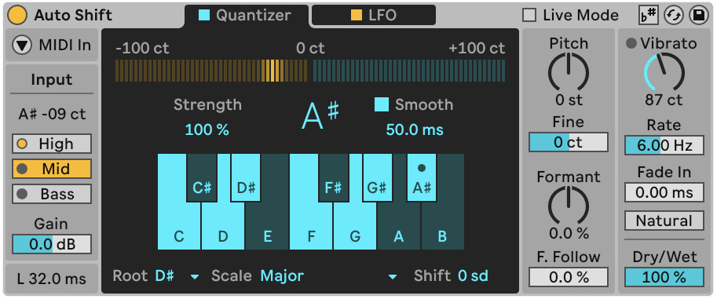

Auto Shift is a real-time pitch tracking and correction effect designed for monophonic audio, particularly, vocal recordings and samples. It supports two correction modes: Quantizer, which corrects pitch against a scale defined within the device, and MIDI, which receives pitch information from an external MIDI track via sidechain. It is useful for harmonies and real-time pitch control.

### 1.1.1 Usage 

Auto Shift is an Audio Effect. It works best on audio tracks with a clear pitched signal — voice, monophonic synth, or bass.

Drag Auto Shift onto an audio track. In the Input section, select the Pitch Range (High, Mid, or Bass) that matches your source material.

The Quantizer setting allows you to select a Root and Scale, or configure individual notes using Included Notes. Use Correction Strength to set how aggressively the pitch is corrected. In the MIDI tab you can enable MIDI In and select a MIDI track as the source. Incoming notes control the pitch correction target in real time.

Use Dry/Wet to blend the corrected signal with the original input.

### 1.1.2 Input - Pitch Tracking and Latency

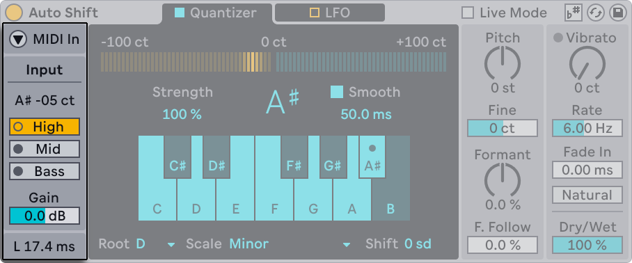

The Input section is where you optimize tracking before you touch “tuning” parameters. The Input Pitch shows you the detected notes in letter notation and cents. 

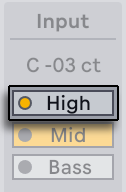

The Pitch Range (High, Mid or Bass) selects the expected input range, making the detection more reliable - you can use High for signals in a high frequency range, Mid for signals in a mid frequency range and, finally, Bass for signal in a lower frequency range. 

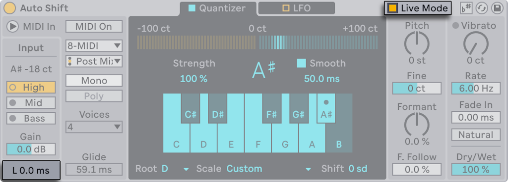

The Input Gain, with the range bwetween -24 to +24 dB trims the signal incoming into the detector for more accurate detection. At the bottom, Latency is displaying in milliseconds the time difference between input and output of the audio device. For live performance scenarios, the Live Mode, which can be toggled in the title bar, reduces latency for performance. This setting can introduce gltiches depending on the speed of the pitch change.

### 1.1.3 Quantizer Mode - Scale-Based Correction

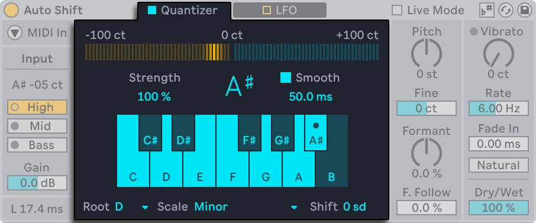

The Quantizer setting aims to correct incoming audio to the notes of a defined scale.

This section contains multiple control which change different aspects of the quantization process. With Correction Strenght you can adjust how strongly the audio is corrected to reach the target note. To combat the corrections made, Smooth, which has a range of 0ms t0 200ms, changes the interpolation time for less artifacts.

In the audio device, there is a built in setting which changes the target musical scale. With Root & Scale you tell the device which target it should reach. You can use the parameters Use Current Scale which will prompt Auto Shift to follow the active clip scale selected in the session (“scale awareness”). Aftewards, the scale’s notes will be highlighted.

If you want to build a custom scale, you can use Included Notes. You to enable and disable note and make your personalized scale. 

For further pitch adjustment, Pitch Shift transposes the sound after correction, while maintaining the target key.

### 1.1.4 MIDI Mode (Pitch Correction from Notes)

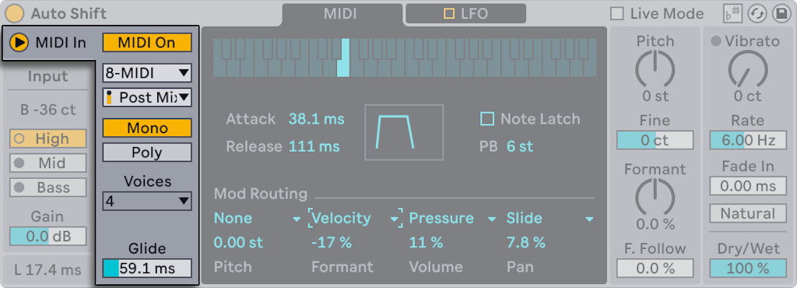

When you enable MIDI In, Auto Shift switches to using incoming MIDI data to determine the target pitch instead of using the scale established in the Quantizer.

You can select in this menu the **External Source** if you want to select and alternate source MIDI. The MIDI Mode includes the setting **Tapping Point**, where you can select if you want to introduce the MIDI signal either Pre FX, Post FX or Post Mixer. You can select Post FX or Post Mixer to include, for example, any audio effects which you might have on your desired MIDI input track.

Choose between two voice modes Mono and Poly to have access to one or up to 8 voices. The Mono mode provides a Glides setting which can be selected for sliding between note values. Polt Mode provides either 2, 4 or 8 voices for harmonization. 

Enabling MIDI Input causes Auto Shift to only output audio when it is receiving MIDI notes.

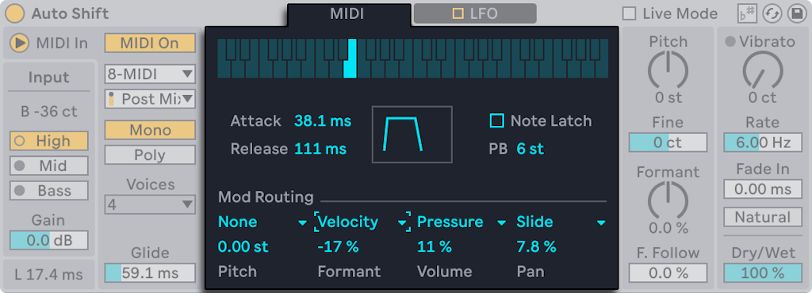

The keyboard at the top shows which MIDI note is currently being received. The keys light up in real time while notes are being updated. 

The MIDI Mode features an Envelope section which includes Attack and Release parameteres which are visualized in the box to their right. Turning on Note Latch will make the last held MIDI note stay active even after the key has been released. 

The Pitch Bend paramenter, abreviated PB, select by how much the pitch will is altered when using the Pitch Bend Wheel on your controller of choice. 

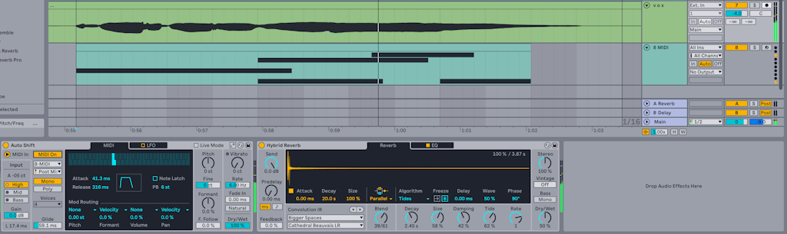

At the bottom of the menu, you can select up to four sources of modulation as input from the MIDI track of choice. Auto Shift is reaching to the external track and pulling the MIDI data to drive the mod writing. 

### 1.1.5 LFO Tab (Modulation)

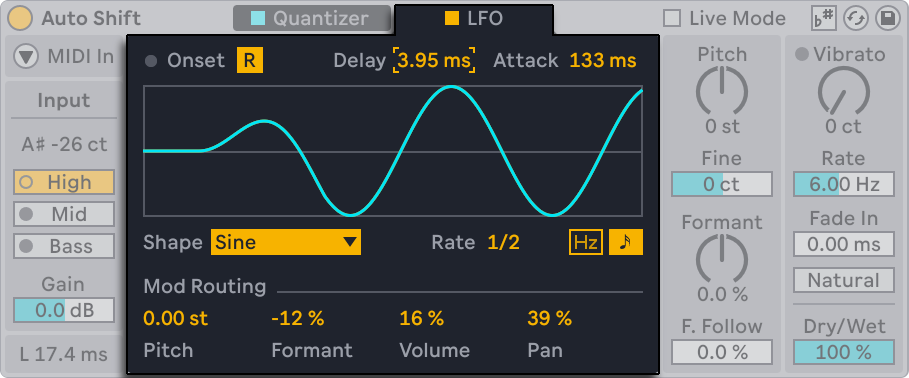

Auto Shift includes an LFO that can modulate the following values: Pitch, Formant, Volume, and Pan.

Opt for the Reset parameters if the you want to retrigger the LFO at onsets. The onset can be either pitch detection in Quantizer mode, or notes in MIDI mode. The Delay and Attack parameters shape how the LFO fades in and fades out.

Custom waveforms are accessible in by selecting Waveform and selecting one of the multiple waveforms, which include stepped, sample and hold and random variants.Optional, the Rate can run free or sync to tempo

The LFO affects the incoming signal even pitch correction is not on.

### 1.1.6 Pitch and Formant Shifting

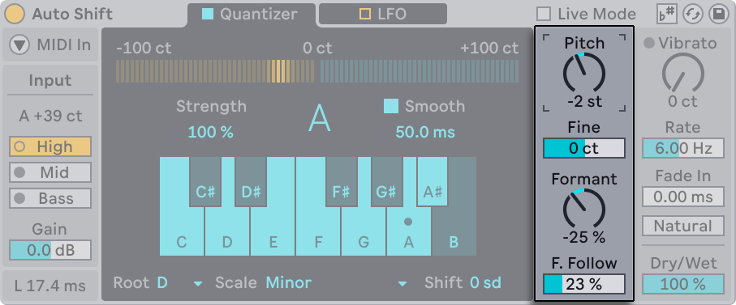

You can use pitch and formant controls for “tuned” effects or as a creative pitch/formant shifter.

You can transpose the signal with Pitch Shift in semitones & cents. This parameter has the option fine in order to tune it in cents. Formant Shift with value between -100% and 100% changes tonal and timbral character without changing perceived pitch.

Developed to achieve a natural sound, Formant Follow links formant movement to pitch movement for more natural results.

### 1.1.7 Vibrato

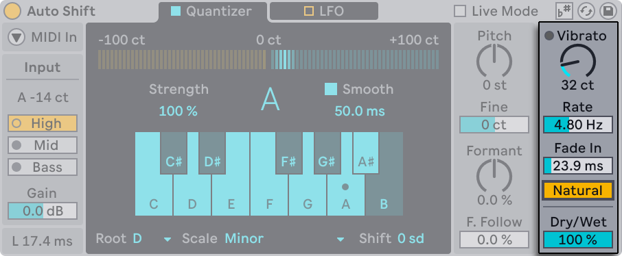

Vibrato is and option useful subtle motion in the signal or harder pitch effects. 

It has an Amount option which can alter the signal by a maximum of 200 cents. You can adjust the Rate of the vibrato by a minimum of 2Hz or a maximum of 15Hz. Choosing a Fade In time selects how quickly the vibrato reaches its target value. Natural Vibrato offer the same effect but with small variations for a more organic feel. 

The Dry/Wet control also lives here. At 50%, you can create a simple doubler-style blend between dry and processed signals.

## 1.2 Beat Repeat

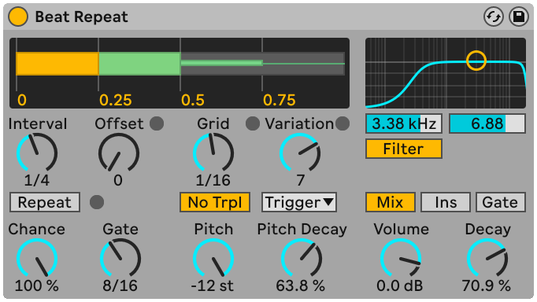

Beat Repeat is an audio effect which triggers the repeat of the incoming signal in a controlled or randomized manner. 

### 1.2.1 Usage

You can use this effect by navigating to "Library" and then selecting "Audio Effects" tab on the right side of you screen. Here you can find the effect and drag and drop directly into your desired audio track with its inital setting.

### 1.2.2 Interval & Offset

The Interval control allows you to select at which time interval the effect should take place. By setting the control, for example, to "1 Bar" your desired repeat effect will take place every 1 Bar of your selected signal. 

You can offset the starting point by using the Offset control using the Offset control. The values of the Offset range from "0" to "15/16" musical notes. The Offset delay the starting point by the value which you select. For example, having an Interval of "1 Bar" and an Offset of "1/16", your Beat Repeat effect will trigger on the second sixteenth of the bar. 

Optionally, by toggling the Repeat button, you can trigger your effect on the spot, allowing for manual control over the duration of th repeat. By using Repeat, the audio effect will continue until the option is toggled off. 

### 1.2.3 Chance & Gate

The Chance control, with values between "0.00%" and "100.00", prompts you to select the probability of triggering the repeating effect. By setting "100%", the effect will trigger everytime, while setting it to "0%" will not trigger the effect at all. 

The Gate parameter controls the total length of all repetitions in sixteenth notes. If set to "4/16" the repetitions will last for that amount of time. 

### 1.2.4 Grid & Variation

The Grid setting allows you to control the divisions of the repeat effect. If you select "1/16", your total lenght of your repetitions selected in the Gate parameter will be divided in sixteenth notes. 

Variation randomizes the Grid size on each repeat. Set Variation to "0" to lock the Grid value, or increase it to allow wider deviations from the set Grid size. At lower values, repeats stay close to the selected Grid value. At higher values, the Grid size varies more broadly.

Variation has several modes, available below the control: Trigger randomizes every repeat cycle. Everytime the Beat Repeat effects takes place, a new grid size is overwritten. By selecting note values, 1/4, 1/8 or 1/16, you randomize the Grid at fixed time intervals (i.e. every 1/4 note, the Grid value is changed). Auto randomizes the Grid value after each individual repeat of the signal instead of the whole repeat cycle.

### 1.2.5 Pitch & Decay

In the Beat Effect you have the possibility to alter the pitch of individual Repeats. By altering the Pitch value, you can transpose the entire signal by a specific semitone amount. 

Made to add more variation, Pitch Decay changes the pitch of the repeats gradually by lowering the semitone value and cents value. This setting works independently from Pitch. 

### 1.2.6 Filter

The single-band Filter changes the spectrum of the sound by eliminating desired frequency. Underneath the graph, it posses a target value and a  quality factor. 

You can turn in on and off by toggling the Filter button underneath the graph. 

### 1.2.7 Mix, Volume & Decay

The Beat repeat effect contains at the bottom right corner a Volume control, a Decay control and 3 different mix options. 

The Beat Repeat effect allows 3 output modes: Mix combines the original signal and the repeated signal, Ins cuts the original signal when the repeat cycle takes place and resumes the original signal when the repeat cycle is done. Finally, Gate, which is most usefull when house on a return track, passes only the repetitions and never the original signal

The Volume control in decibels the loudness of the repeated signal, while the Decay control, gradually fade out the signal. Setting the Decay value to "0%" will keep the Volume unaltered, while "100%" will allow less repeats wih a lower volume.